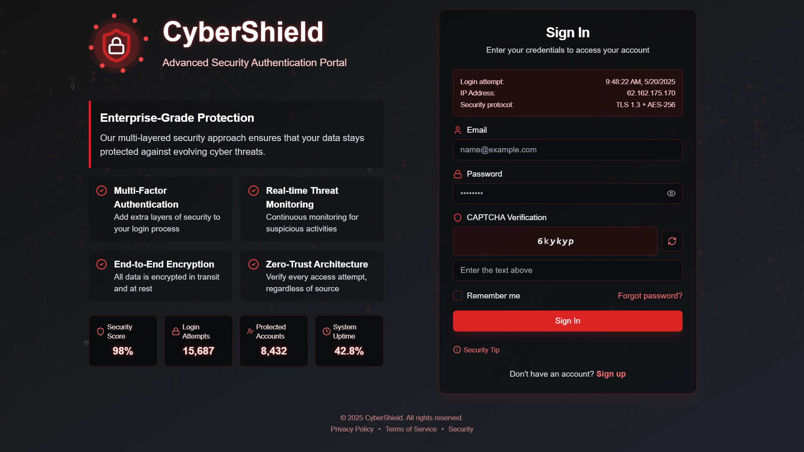

# 🛡️ Cybersecurity Login Page UI

This project is a responsive, accessible, and modern login page UI designed for a cybersecurity-themed web application.
---

## 🚀 Features Implemented

- ✅ **Responsive Design**
- ✅ **Email & Password Input Fields**
- ✅ **Remember Me Checkbox**
- ✅ **Forgot Password Link**
- ✅ **Loading Indicator on Login**
- ✅ **Clear Error Messages**
- ✅ **Keyboard Accessibility & ARIA Labels**
- ✅ **Modern and Clean UI**
- ✅ **Dark Cybersecurity Theme**
- ✅ **Basic Client-side Validation**
- ✅ **Reusable React Components**

---

## 🛠️ Tech Stack

- React.js
- HTML5 & CSS3
- JavaScript (ES6+)
- Tailwind CSS / CSS Modules (depending on your stack)
- Git & GitHub

---

## 📷 Screenshots




---

## 📁 Folder Structure

CYBERSECURITY-THEMED-LOGIN-PAGE/ ├── node_modules/ ├── public/ │ └── shield-logo.png ├── src/ │ ├── components/ │ │ ├── CyberSecurityBackground.jsx │ │ ├── Logo.jsx │ │ ├── PasswordStrengthMeter.jsx │ │ ├── SecurityStats.jsx │ │ └── SecurityTlps.jsx
│ ├── lib/ │ │ └── utils.js │ ├── ui/ │ │ ├── button.jsx │ │ ├── card.jsx │ │ ├── checkbox.jsx │ │ ├── form.jsx │ │ ├── input.jsx │ │ └── label.jsx │ ├── App.jsx │ ├── index.css │ └── main.jsx ├── .gitignore ├── components.json ├── index.html ├── jsconfig.json ├── package-lock.json ├── package.json ├── postcss.config.js ├── README.md ├── tailwind.config.js └── vite.config.js


---

## 📦 How to Run the Project Locally

1. **Clone the Repository**

    ```bash
    git clone https://github.com/INFINITYASH3699/Cybersecurity-Themed-Login-Page.git
    cd Cybersecurity-Themed-Login-Page
    ```

2. **Install Dependencies**

    ```bash
    npm install
    ```

3. **Start Development Server**

    ```bash
    npm start
    ```

4. Open in browser: [http://localhost:3000](http://localhost:3000)

---

## 🌐 Live Demo

https://cybersecurity-themed-login-page.vercel.app/

---

## 📧 Contact

**Yash Hulle**  
📞 9665187273  
📧 yash.hulle3699@gmail.com  
📍 Pune, India  
[in] https://www.linkedin.com/in/yash-hulle/

---